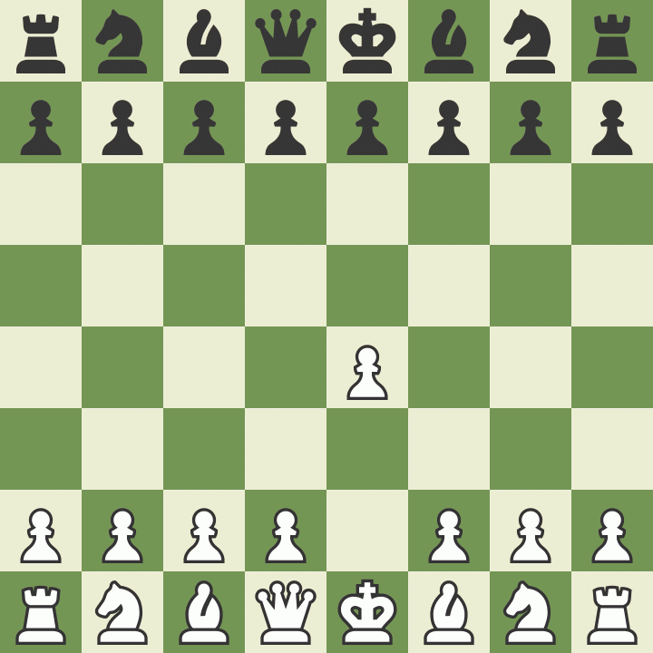

# 1. e4 - King's Pawn Game

The point of this move is to control the center and open lines for the queen and light squared bishop. Favors more theory rather than setup based openings.Leads to more tactical rather than positional games. Learn [more](https://en.wikibooks.org/wiki/Chess_Opening_Theory/1._e4).

# 1. e4 e5 - Open Game

The point of this move is to control the center, hault White's e pawn's advance down the file and stop White from getting complete control over the center with 2. d4. Learn [more](https://en.wikibooks.org/wiki/Chess_Opening_Theory/1._e4/1...e5).

## 1. e4 e5 2. Nf3 - King's Knight Opening

The point of this move is to develop the g knight towards the center and attack Black's weak e5 pawn. Learn [more](https://en.wikibooks.org/wiki/Chess_Opening_Theory/1._e4/1...e5/2._Nf3).

## 1. e4 e5 2. Nf3 Nc6 - King's Knight Opening: Nc6

The point of this move is to develop the b knight towards the center and defend the weak e5 pawn from White's knight. Learn [more](https://en.wikibooks.org/wiki/Chess_Opening_Theory/1._e4/1...e5/2._Nf3/2...Nc6).

### 1. e4 e5 2. Nf3 Nc6 3. Bc4 - Italian Game

The point of this move is to attack the weak f7 square, develop the bishop to an active diagonal and prepare kingside castling. Learn [more](https://en.wikibooks.org/wiki/Chess_Opening_Theory/1._e4/1...e5/2._Nf3/2...Nc6/3._Bc4).

### 1. e4 e5 2. Nf3 Nc6 3. Bc4 Bc5 - Giuoco Piano Game

The point of this move is to attack the weak f2 square and develop the bishop to an active diagonal. Learn [more](https://en.wikibooks.org/wiki/Chess_Opening_Theory/1._e4/1...e5/2._Nf3/2...Nc6/3._Bc4/3...Bc5).

# 1. e4 f6 - Barnes Defense

An unsound opening. The point of this move is to get out of theory. Learn [more](https://en.wikibooks.org/wiki/Chess_Opening_Theory/1._e4/1...f6).

### 1. e4 f6 2. ... g5 3. Qh5# - Fool's Mate

An unsound opening. The fastest possible checkmate for White.

#### 1. e4 f6 2. ... h5 3. Qh5+ g5 4. Qxg5# - Pseudo Fools Mate

An unsound opening. It is a variation of the Fool's Mate.